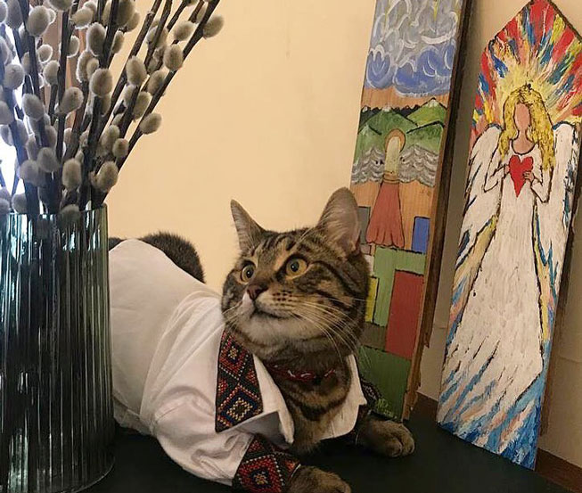

# Classes_games
Repository made for two games.

Each task has its directory.
In the task directory you can find a folder with all the classes and __init__ module to import all the classes for the main. py

## Task 5 Description
The game has a folder with all the necessary classes for it to function properly.
- Character: is the main class for all the character, Friend and Enemy inherit it.
- Enemy: the class for the enemies, who can be fought and defeated with their weakness item.
- Friend (not used in the main.py, but created an additional version with its usage in main_with_friend.py): can help you choose the right weapon for the enemy and notify of dange in the room about to be entered.
- Item: the class for all the items that can be used throughout the game.
- Room: the class for all the settings and rooms.

<h2 style="color:#009900;">Task 6 - "Helping Levchyk!"</h2>



The game has a folder with all the necessary classes for it to function properly.
The purpose of the game is to go all the way to Rynok Square from Kozelnytska street to bring all the treats for Levchyk.
On the way there, you can encounter different characters, and not all of them are going to be friends! You should beware of batyar and lotr. If you have the requested item for them, you will be able to pass to the next street, otherwise you will fail the game. There are also some friends, who can give you treats for Levchyk, but some require an item to be given for them as well.

- Character: is the main class for all the character, Friend and Enemy inherit it.
- Levchyk: is the very first mayor of all the cats in Lviv, he is nothing but a Friend to you!
- Enemy: the class for the enemies, who can inspect your torba for the desired items.
- Friend: can notify you of dange in the room about to be entered.
- Batyar: a free-spirit and adventurous Batyar, who can be dangerous only in terms of inspecting your purse for Piana Vyshnia...
- Lotr: an extremely hideous and dangerous thief!
- Cavalier: a friend of yours, who always tries to take you out, but has something yummy for Levchyk!
- Student: a sleep-deprived creature, who would do anything for a cup of coffee... Also in return gives you a treat!
- Street:  the class for all the settings and streets.
- Item: the class for all the items that can be used throughout the game.

<h2 style="color:#009900;">Launch example (Starting the game)!</h2>

```
Kozelnytska street
--------------------
A well-known street among UCU students.
You can go to 'Stryiska street'
Andriy Sadovyi
A dedicated mayor to his city and citizens.
The [Coffee] is here - A drink for every person, who couldn't sleep.
>
```
